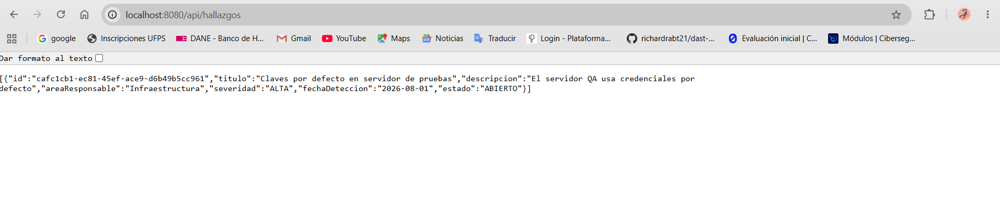
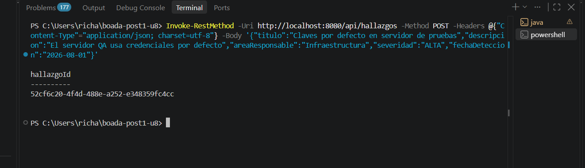
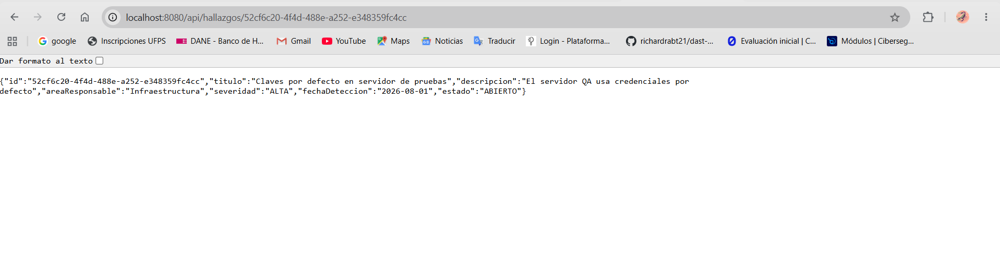

# Post-contenido Unidad 8: Patrones Arquitectónicos II

## Descripción
Repositorio del post-contenido de la Unidad 8 de Patrones de Diseño de Software Sexto Semestre. Sistema de seguimiento de hallazgos de auditoría interna implementado con Clean Architecture (Parte 1) y extendido con dashboard agregado y bitácora de trazabilidad (Parte 2), sobre el mismo proyecto Spring Boot.

## Parte 1: Clean Architecture (Hallazgos de Auditoría)
El proyecto organiza los cuatro círculos concéntricos: Entities (domain/, con el Aggregate Root HallazgoAuditoria y su máquina de estados EstadoHallazgo), Use Cases (usecase/, con los puertos y sus implementaciones), Interface Adapters (adapter/, con HallazgoController y HallazgoRepositoryAdapter) y Frameworks & Drivers (Spring Boot + JPA). La dependencia del código siempre apunta hacia adentro, hacia domain/.

## Parte 2: Análisis costo-beneficio de CQRS/Event Sourcing
* **Escala y carga:** El sistema es académico, operado por un único usuario (desarrollador) sin concurrencia real. No existe una diferencia de escala entre lecturas y escrituras que justifique separar la infraestructura.
* **Complejidad de las consultas:** Los conteos y promedios del dashboard son alcanzables mediante consultas JPQL simples con funciones de agregación (`GROUP BY`, `AVG`) sobre el esquema actual, sin requerir un modelo de lectura distinto.
* **Consistencia:** El comité no requiere consistencia eventual compleja; el estado actual reflejado al momento de la consulta es perfectamente manejable bajo demanda con la base de datos transaccional.
* **Naturaleza de la trazabilidad:** Cumplimiento necesita una bitácora cronológica, pero no exige reconstruir el estado completo reproduciendo eventos (Event Sourcing). Una tabla adicional de registro cumple la norma legal.
* **Señales de sobre-ingeniería:** No hay expertos en modelado de eventos disponibles y el costo de mantener dos modelos separados es desproporcionado para este problema.

**Conclusión:** Se justifica implementar una **extensión liviana** en lugar de CQRS/Event Sourcing completos, utilizando el mismo repositorio con proyecciones de Spring Data JPA y una bitácora append-only adicional.

## Decisiones de diseño
1. **Severidad como enum simple vs. EstadoHallazgo como enum con máquina de estados:** `EstadoHallazgo` encapsula reglas de negocio reales (qué transiciones son válidas), mientras que `Severidad` es solo una clasificación estática sin comportamiento.
2. **PlanRemediacion como Value Object embebido vs. agregado separado:** Se modeló como VO embebido para respetar el límite de consistencia transaccional; un hallazgo no puede pasar a `EN_REMEDIACION` sin un plan válido en la misma transacción.
3. **CQRS/Event Sourcing completos vs. extensión liviana del repositorio existente:** Basado en los criterios de la Sección 7, se eligió la extensión liviana porque la escala, complejidad de consultas y falta de necesidad de consistencia eventual no justifican infraestructuras separadas.
4. **Bitácora simple (HistorialCambioEstado) vs. Event Store completo:** Un Event Store completo requeriría reconstruir el Aggregate desde cero por replay de eventos. Una bitácora simple evita esta sobre-ingeniería cumpliendo el requisito legal de auditoría.

## Capturas de Pantalla
Evidencia visual de los endpoints funcionando:

**1. Registro y Consulta de Hallazgos (Parte 1):**

**2. Dashboard Agregado (Parte 2):**

**3. Historial de Auditoría (Parte 2):**

## Cómo ejecutar
Ejecuta los siguientes comandos en la terminal:
mvn clean package
mvn spring-boot:run

## Herramientas utilizadas
Java 17, Spring Boot 3.x, Spring Data JPA, H2, Apache Maven, Git, GitHub.

## Conclusiones
La Clean Architecture facilita enormemente la extensibilidad. Al implementar la Parte 2, pudimos añadir proyecciones de lectura y una bitácora de auditoría inyectando nuevos puertos sin alterar el núcleo de la aplicación (Entities). Si el sistema creciera masivamente en concurrencia y complejidad de reportes, el aislamiento actual de los Use Cases permitiría migrar hacia un modelo CQRS completo de forma natural.